# Assignment 3 – CI Checks, Reporting & Artifact Management Across Multiple Repositories

## Overview

This assignment focuses on setting up **Continuous Integration (CI) checks** using Jenkins Freestyle jobs across three different technology-stack repositories, storing generated reports, managing build artifacts, and configuring failure notifications.

### Repositories Covered

| Language | Repository |
|----------|------------|
| Python   | `https://github.com/OT-MICROSERVICES/attendance-api` |
| Go       | `https://github.com/OT-MICROSERVICES/employee-api` |
| Java     | `https://github.com/opstree/spring3hibernate.git` |

### CI Checks Implemented (per repository)

For each of the three repositories, a dedicated **folder** was created inside Jenkins (`Assignment-3 → Python`, `Assignment-3 → Go`, `Assignment-3 → Java`), and inside each folder, four separate Freestyle jobs were configured to perform the required generic and advanced CI checks:

1. **Credential-Scanning** – Scans the repository's Git history/commits for accidentally leaked secrets/credentials using **Gitleaks**.
2. **Unit-Testing** – Runs the repository's unit test suite (pytest for Python, `go test` for Go, Maven Surefire for Java) and generates test reports.
3. **Code-Coverage** – Measures how much of the codebase is exercised by tests (using `pytest-cov`/coverage.xml for Python, Go's built-in coverage tooling for Go, and JaCoCo for Java) and publishes an HTML coverage report.
4. **Dependency-Security** – Resolves and analyzes the project's dependencies (pip packages for Python, Go modules for Go, Maven dependency tree for Java) to check for outdated or vulnerable versions.

Each job:
- Pulls the respective repository directly from GitHub.
- Runs its specific check as a shell/build step.
- Archives the generated reports (JSON/XML/HTML) as Jenkins build artifacts using the **HTML Publisher** plugin and/or `Archive the artifacts` post-build action, so reports remain accessible from within Jenkins itself.
- Is configured to send **Slack** and **Email** notifications automatically if the build/check fails.

---

## Design Decisions

### Why separate jobs per check (instead of one big job per repo)?

Two approaches were considered:

1. **Single combined job per repository** – One Freestyle/Pipeline job per repo that runs credential scanning, unit testing, coverage, and dependency checks sequentially in one build.
2. **Separate job per check, grouped inside a per-repository folder** *(selected approach)* – Four independent jobs (`Credential-Scanning`, `Unit-Testing`, `Code-Coverage`, `Dependency-Security`) per repository, organized inside a Jenkins folder named after the repo/language.

**Decision:** The **separate-job-per-check** approach was selected because:
- Each check has a different purpose, different tooling, and a different failure meaning — keeping them separate makes it immediately clear from the Jenkins dashboard *which specific check* failed, rather than having to dig through one long combined console log.
- Reports and artifacts for each check type are archived independently, making it easier to browse historical trends for, say, code coverage alone, without unrelated logs mixed in.
- Notifications (Slack/Email) can be scoped precisely to the failing check, so the team knows exactly what broke (e.g., "Dependency-Security failed" vs. "Unit-Testing failed") instead of a generic "the pipeline failed" message.
- It mirrors how real CI systems are usually organized — separate, composable jobs rather than one monolithic script — making the setup easier to maintain and extend if a new check type is added later.

### Reports & Artifacts Storage

- **Local storage** (Jenkins' own artifact archive, on the same server/workspace) was chosen for storing reports and artifacts, since this is a learning/assignment environment and Jenkins' built-in artifact archiving + HTML Publisher plugin was sufficient to view reports directly from the build page without needing an external artifact repository (like Nexus or S3).
- HTML coverage reports (`htmlcov`, JaCoCo reports) are published using the **HTML Publisher** plugin so they can be viewed directly inside Jenkins' UI.
- Raw XML/JSON reports (`coverage.xml`, `gitleaks-report.json`, JUnit/Surefire XML) are archived as build artifacts for further processing or audit.

### Notifications

- **Slack notifications** are sent for both failures and (where configured) successful completions, so the team has continuous visibility into build health.
- **Email notifications** are configured to trigger automatically on build failure, and in some jobs also on success, ensuring no failed CI check goes unnoticed.

---

## Solution Quality Checklist

- ✅ **Solution working fine** — All 12 CI jobs (4 checks × 3 repositories) were run and verified successfully, with green `SUCCESS` results and correctly generated reports for each check type.
- ✅ **Solution is of good quality** — Jobs are organized cleanly into per-repository folders with a consistent naming convention (`Credential-Scanning`, `Unit-Testing`, `Code-Coverage`, `Dependency-Security`), making the setup predictable and easy to navigate.
- ✅ **Boundary conditions are also handled** — Verified behavior both when no secrets are found (Python/Go credential scans: "no leaks found") and when a secret *is* detected (Java credential scan: "leaks found: 1"), confirming the scan step correctly distinguishes clean vs. flagged commits.
- ✅ **Done solution designing beforehand** — The folder structure (per-language folder → 4 check jobs) and the choice of tools per language (pytest/coverage for Python, native Go tooling for Go, Maven/JaCoCo for Java) were planned before implementation began.
- ✅ **Thought about at least 2 solutions for the problem and then selected the best solution** — Compared a single combined CI job per repository against separate jobs per check type, and selected the separate-jobs approach for clearer failure isolation, reporting, and notification scoping.
- ✅ **Documentation** — This README documents the overall CI design, the checks implemented per repository, the reasoning behind key design choices, and screenshot-based verification of every job across all three repositories.

---

## Screenshots (Serial-wise Explanation)

**1. Assignment-3 Folder – Repository Sub-folders**
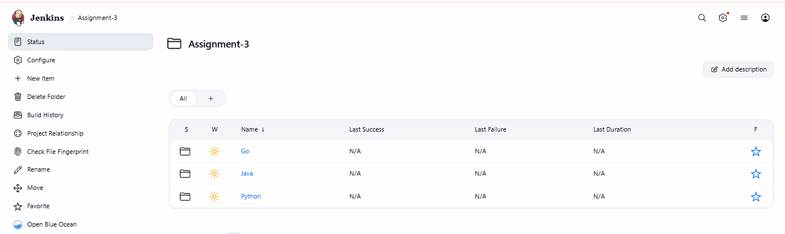
Shows the top-level `Assignment-3` folder in Jenkins containing three sub-folders — `Go`, `Java`, and `Python` — one for each repository being checked.

**2. Python – Credential-Scanning Console Output**
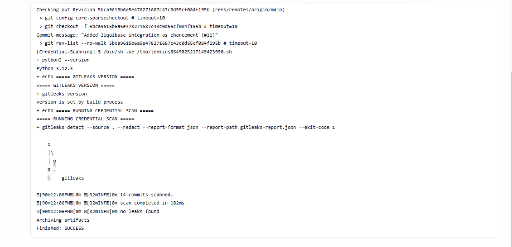
Shows the `Credential-Scanning` job for the Python (`attendance-api`) repository running Gitleaks against 14 commits. The scan completes with "no leaks found," and the build finishes with `SUCCESS`.

**3. Python – Unit-Testing Console Output (Build #19)**
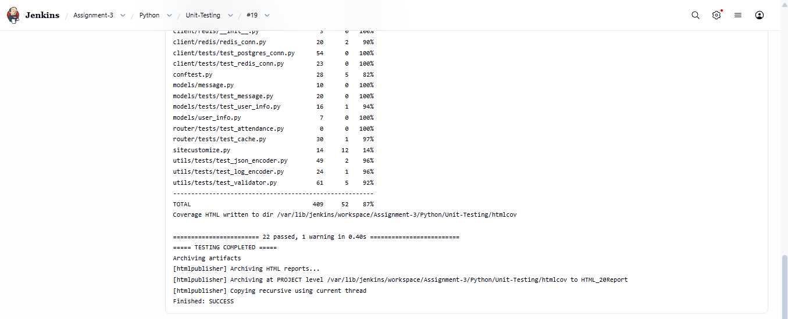
Shows the per-file coverage summary generated during unit testing of the Python repository, along with the final result: 22 tests passed with 1 warning. The HTML coverage report is archived and published via the HTML Publisher plugin.

**4. Python – Code-Coverage Console Output (Build #8)**
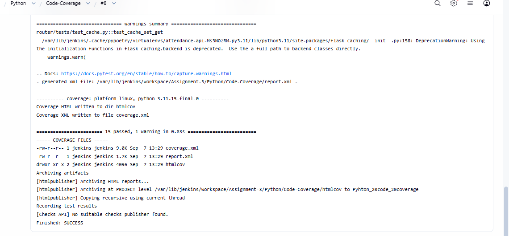
Shows the dedicated Code-Coverage job output: 15 tests passed, and both `coverage.xml` and an `htmlcov` HTML report are generated and archived as build artifacts, along with a "Python code coverage" HTML report published inside Jenkins.

**5. Python – Dependency-Security Console Output (Build #2)**
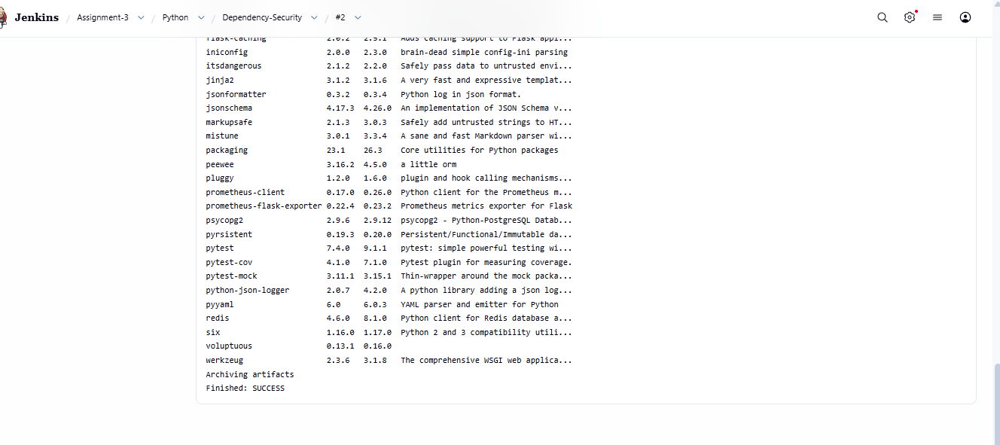
Shows the Dependency-Security job listing outdated Python packages (old version vs. new version available) for the `attendance-api` project, helping identify dependencies that may need to be upgraded for security or compatibility reasons. Build finished with `SUCCESS`.

**6. Go – Credential-Scanning Console Output (Build #4)**
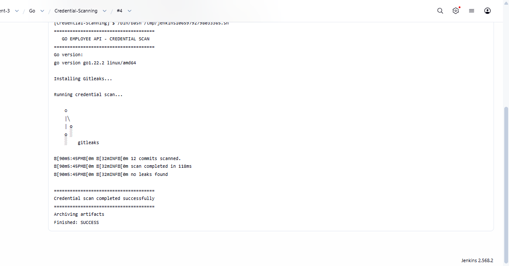
Shows the Credential-Scanning job for the Go (`employee-api`) repository. Gitleaks scans 12 commits and reports "no leaks found," confirming no secrets are exposed in the Go repository's history. Build finished with `SUCCESS`.

**7. Go – Unit-Testing Console Output (Build #1)**
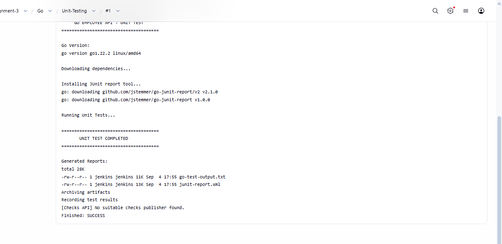
Shows the Go Unit-Testing job downloading dependencies, installing a JUnit report conversion tool, and running the Go test suite. Generated reports (`go-test-output.txt`, `junit-report.xml`) are archived as build artifacts. Build finished with `SUCCESS`.

**8. Go – Code-Coverage Console Output (Build #1)**
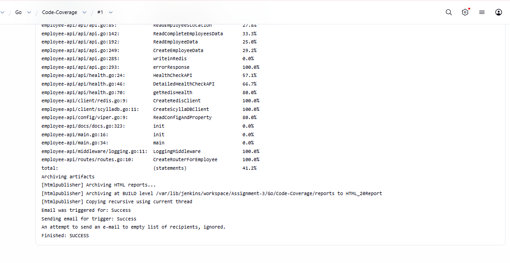
Shows a detailed function-by-function code coverage breakdown for the Go repository (e.g., `ReadEmployeeData`, `CreateEmployeeData`, `HealthCheckAPI`), with an overall total coverage of 41.2% of statements. The HTML report is archived, and a success email notification is triggered.

**9. Go – Dependency-Security Console Output (Build #5)**
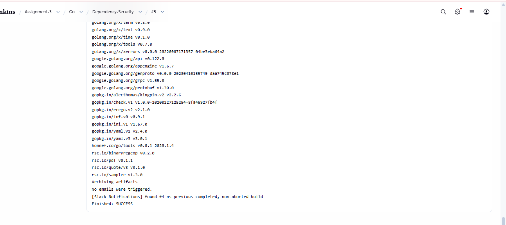
Shows the list of Go module dependencies resolved for the `employee-api` project (e.g., `golang.org/x/...`, `google.golang.org/...`, `gopkg.in/...`), confirming the dependency resolution/analysis step completed successfully with artifacts archived and a Slack notification check performed against the previous build.

**10. Java – Credential-Scanning Console Output (Build #5)**
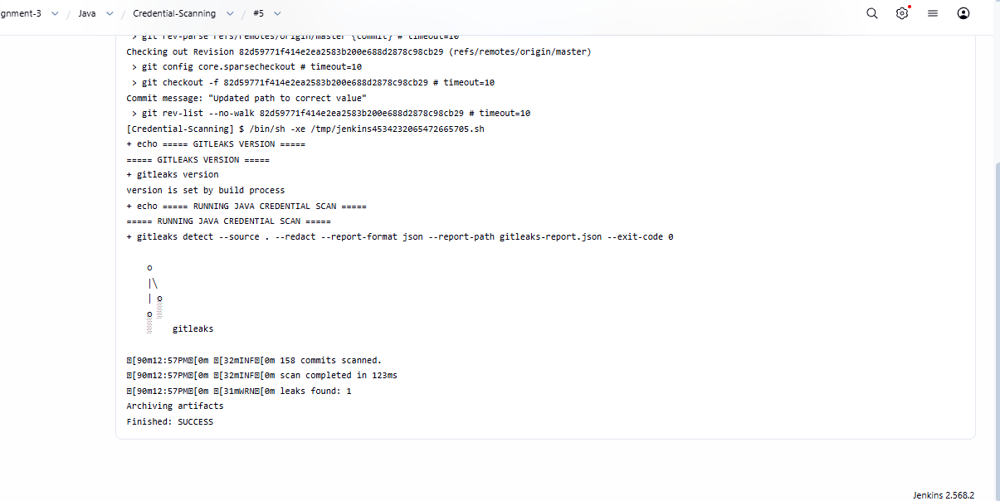
Shows the Credential-Scanning job for the Java (`spring3hibernate`) repository. Gitleaks scans 158 commits and this time reports **"leaks found: 1"**, demonstrating that the scan correctly detects and flags an actual leaked credential/secret in the Java repository's history rather than always reporting a clean result.

**11. Java – Unit-Testing Console Output (Build #5)**
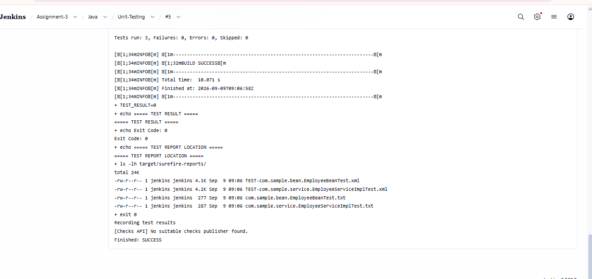
Shows the Maven Surefire unit test results for the Java repository: 3 tests run, 0 failures, 0 errors, 0 skipped, with a `BUILD SUCCESS` message and test report files (`.xml`/`.txt`) listed under `target/surefire-reports/`.

**12. Java – Dependency-Security Console Output (Build #2)**
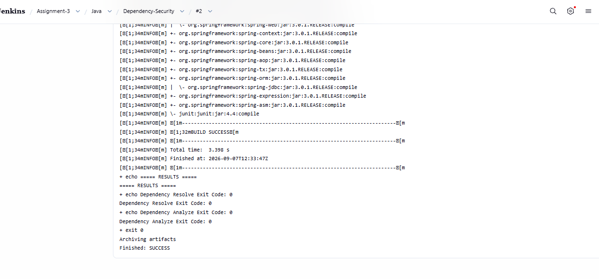
Shows the Maven dependency tree resolution for the Java project (Spring Framework modules such as `spring-web`, `spring-context`, `spring-core`, etc.), confirming `BUILD SUCCESS` for both the dependency resolve and dependency analyze steps, with artifacts archived.

**13. Java – Code-Coverage Console Output (Build #19)**
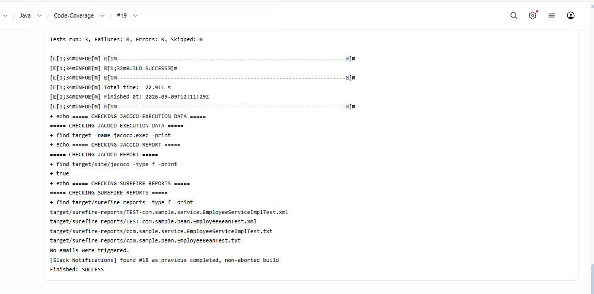
Shows the Java Code-Coverage job verifying the presence of JaCoCo execution data and reports, along with the Surefire test report files, confirming that coverage data is being generated correctly. Build finished with `SUCCESS`, and a Slack notification check was performed against the previous completed build. 
